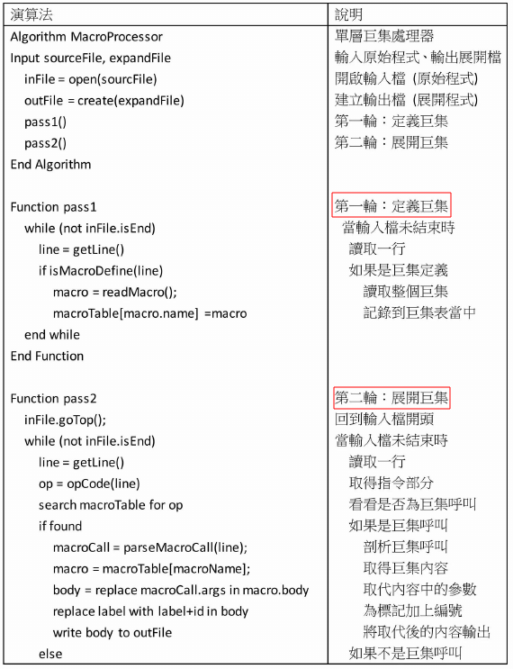
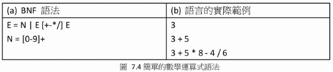

# 系統程式筆記
```
書名：系統程式
作者：陳鍾誠
```
## 系統軟體
### 什麼是系統程式
系統程式常被翻譯成**System Software** 或 **System Programming**。

系統軟體是什麼？有一個不精確的講法“凡是給程式設計師使用的工具軟體，就被稱為系統軟體。”

基於上述的定義，就可以舉例出以下幾種軟體：組譯器，載入器，鏈結器，巨集處理器，編譯器，直譯器，虛擬機，作業系統...。

系統程式又是什麼呢？指的是系統相關的程式設計技術。常見分成兩種一種是**作業系統**，另一種是**電腦系統**。

狹義的系統程式：包含作業系統(Linux, Windows, unix...)，這些主題包括“行程管理”，“執行序”，“並行控制”，“記憶體管理”，“檔案管理”...各種作業系統相關的**管理**

廣義的系統程式：還包括了硬體相關的程式(verilog ...)，組合語言，c語言，嵌入式系統...等

### 機器語言到組合語言


### 程式語言的演進
從一開始的機器語言
```
00010011000100100011000000000000
```
對人來說太費勁了，所以又把它分段了
```
0001 0011 0001 0010 0011 0000 0000 0000
```
還是太長了，把二進制轉成十六進制(Hex)
```
13 12 30 00
```
是短了，但是還要用對照表來理解執行什麼，再把它改進成文字比較好理解
```
ADD R1,R2,R3 ;R代表Register，這行表示R1=R2+R3
SUB R1,R2,R3 ;R1=R2-R3
LD R1,[300] ;R1=記憶體位址300的內容
ADD R1,COUNT ;COUNT也是代表記憶體位址，R1=COUNT位址的內容
```
### 組合語言到高階語言

### 本書架構

### GNU工具


## 電腦硬體結構
### CPU0處理器
由作者設計的簡易32位元處理器。擁有19個32位元的暫存器。


這3個暫存器是由控制單元自動操作，不能經由組合語言存取
- IR是指令暫存器(Instruction Register)，用來存放當前執行的指令
- MAR是記憶體位址暫存器(Memory Address Register)，可以用來暫存Bus上的位址資訊
- MDR是記憶體資料暫存器(Memory Data Register)，可以用來暫存Bus上的資料訊息
******
- R1~R11是普通的暫存器
- R0是唯讀的常數暫存器，R0=0
- R12是狀態暫存器(Status Word,SW)
- R13是堆疊暫存器(Stack Pointer, SP)
- R14是鏈結暫存器(Link Register, LR)
- R15是程式計數器(Program Counter, PC)
### 馮紐曼架構


現在的電腦日新月異，但是基本架構還是基於馮紐曼架構來，沒有特別的變化。
### CPU0的常見指令集
|種類|常見指令|說明|
|:-----------|:---------|:--------|
|載入存儲指令 |LD, ST, LDB, STB...|LD(LOAD WORD),ST(STORE WORD), LDB(LOAD BYTE), STB(STORE BYTE)
|運算指令     |CMP, MOV, ADD, SUB, MUL, DIV, AND, OR, XOR...||
|跳躍指令     |JEQ, JNE, JLT, JGT, JLE, JGE|JEQ(Jump if Equal), JNE(Jump if Not Equal), JLT(Jump if Less Than), JGT(Jump if Greater Than), JLE(Jump if Less or Equal), JGE(Jump if Greater or Equal)|
|堆疊指令     |PUSH, POP, PUSHB, POPB||
### CPU0的指令格式


A(Arithmatic), J(Jump), L(Load&Store)

### 定址模式*
CPU0實際上有3種定址方法：

**立即載入**：

直接把指令的常數值載入到寄存器，ex:LDI R1,100，但是LDI不只是把100放入R1。
而是特殊格式`LDI Ra,Rb+Cx`的隱藏，實際上LDI R1,100是LDI R1,R0+100。

再舉一個例子，像是LDI R1,R2+100，可以在載入到R1前把R2+100加完送進去，**好處是少了一個加法指令，還可以沿用L型指令**。

**相對定址**：

LD,ST,LDB,STB這些指令都是**相對定址**，ex:LD R1,[R2+100]，從記憶體R2+100的位址把資料移到R1，R2稱為base register，100稱為偏移位址。

`LD Ra,[Rb+Cx]`格式，如果Rb是R0可以被省略成LD R1,[100]，這就從相對定址延伸出來的**絕對定址**。

**索引定址**：

LDR,STR,LBR,SBR這些指令都是**索引定址**，舉例來說:LDR R1,[R2+R3]，從記憶體R2+R3的位址把資料移到R1，R2稱為基底暫存器，R3稱為索引(偏移)暫存器。

另外在舉例，ex:int a[100]，如果要存取a[i]的元素，依照`LDR Ra,[Rb+Rc]`格式，a存入到Rb，i*4(integer佔4byte)存入Rc中，然後利用`LDR Ra,[Rb+Rc]`指令，將a[i]存入Ra。

**絕對定址**：

舉例來說，像是LD R1,[100]這個指令就是絕對定址。
CPU0不需要絕對定址，而是改用R0暫存器來代替，LD R1,[R0+100]就等同於LD R1,[100]

CPU0的絕對定址方式會有限制，只能在Cx限定的範圍內-2^15-2^15-1，因為Cx使用2的補數。
而且絕對定址沒有使用負數，所以範圍只有到0-32767，其餘的位址就需要**相對位址**來協助

沒有為CPU0另外設計絕對定址專用指令，缺失就是絕對定址的位址範圍較小，但是優點是可以讓它附屬於**相對定址**，讓CPU0指令集更精簡。

### 指令執行的經過*
CPU0執行指令時，必須經過**提取，解碼，執行**等三大步驟


提取後還更新了**PC=PC+4**，所以假設這個指令是jmp 0x0030(PC 相對定址)，它的位址在0x0028，那他要跳躍到0x005c。因為PC+4等於0x002c


### 電腦元件架構

## 組合語言
### 陣列存取


******


範例3.8跟3.9雖然都做複製字串，但是效率上有差異，索引版的多了很多行指令。
### 定址問題


X:RESW 100000佔用了十萬個Words，一個Word佔4Byte這樣就佔用了400000Byte了。
**相對於PC位址**的方式就不可行，因為Cx的限制-32768~32767，會不夠用。修正版多了APtr來修改基底為R9，避免了數據離指令過遠。
(這其實沒有完全解決X的問題，它後面的還是會無法運用到)

### 初始值
類似C語言的初始化語法，像是0x開頭的變數當Hex

**Literal**是CPU0的初始值的一種

LD R1,"EOF"，你可能以為是直接把"EOF"直接放入R1，但是實際上是使用Literal把它展開當成變數使用


通常在使用Literal的時候，組譯器會把它安排到最後才展開，這樣就會遇到**定址問題**。

解決辦法就是使用`LTORG`來讓組譯器提前展開Literal。


### 假指令 Pseudo Instruction
像是ORG,EQU...等，或者是分段指令.data,.text，這些指令CPU都不會執行，只是為了可以讓代碼跟易懂。

#### EQU
就像是C語言中的#define一樣


也可以當struct使用


#### ORG
重新設定組譯器的位址，ORG跟EQU都是為了解決同樣的問題，只是做法不太一樣。


ORG person把它重定向到person:，使得name跟person重疊，後面接續age。
### 簡單分段

## 組譯器
### 簡介

### 轉換成目的碼(Object code)

#### 絕對定址法
從R0開始，所以不會有負數的情況。那範圍就會被限制在0~32767，這是相當的不合理。(32位元的電腦可以分配4G的記憶體)
#### 相對定址法
以PC為Base，其原因是指令跟資料通常都放在同一個程式中，所以距離不會差太多，只要不超出Cx的範圍就可以了。而且單一模塊的程式很少超過32KB。
### 二階段的組譯方式
1. 運算元轉換：opcode的轉換，如LD轉成00，ST轉成01
2. 參數轉換：暫存器的轉換，R0轉成0，R10轉成A
3. 資料轉換：Cx的位置資料的轉換，還有SYMTAB的轉換
4. 目的碼生成(Object code Generating)


### 組譯器的演算法
#### PASS 1(計算出符號位址，輸出符號表)
1. 決定指令的長度，WORD,BYTE,RESW,RESB等指令資料長度，假指令的長度，普通指令A,L,J長度都固定
2. 算出每一行的位址
3. 儲存變數跟標籤的位址，做出符號表(Symbol Table)
#### PASS 2(輸出Object Code)
1. 依照Opcode Table來轉換成機器碼，LD轉成00，ST轉成01
2. 轉換指令參數為機器碼，R3轉成3，B轉成01 0C
3. 轉換資料定義指令為位元值，WORD B 28轉成0000001C
4. 輸出目的碼到目的檔


### 組譯範例

#### PASS 1:


#### PASS 2:

## 鏈結與載入 (Linker and Loader)
### 簡介
**鏈結器**是用來將許多**目的檔**鏈結成一個執行檔的程式。

**載入器**將執行檔載入到記憶體中來執行程式。

**目的檔**是組合語言經過組譯器之後生成出的機器語言。

### 單一檔案的載入


**Object code**


**簡單載入器演算法**


**載入到記憶體中**


### 目的檔
#### C語言 Stack範例


#### 轉組合語言 Stack範例 


上面的範例中使用了3種**假指令來分段**：
- **.bss**是Block Started by Symbol的縮寫，存儲未初始化全域變數名稱，像是RESW,RESB
- **.text**則是內文段(或是程式段)，用來儲存程式的程式碼
- **.data**則是資料段，用來存儲已初始化全域變數，像是WORD,BYTE
  
還有2種假指令來**運用全域變數**：
- **.global**宣告某變數為全域變數，可以提供外部程式應用
- **.extern**引用全域變數必須使用的假指令，可以告訴組譯器是外部變數

**為什麼要叫.text不叫.code?**

因為程式中也會包含區域變數，程式中不僅僅只有程式也有變數(資料)。

> **C語言的function默認都是`extern`，所以function可以被外部引用。(這個extern跟這裡講的有點不一樣)**

#### 再轉成目的碼(包含假指令)
**StackType**


**StackFunc**


紅色的**F**代表PC(R15)，.text中出現了**F**就是要在鏈結時修改它

**M**記錄了要修改的位址，變數名稱，使用的方法(pc相對位址)

**StackMain**


目的碼的分段與重定位：
- **T**(.text)：程式段的目的碼
- **D**(.data)：資料段的目的碼
- **B**(.bss)：保留BSS段的空間
- **M**(Modification)：修改記錄或稱重定位記錄，這裡採用了**相對PC位址來計算**
- **S**(global)：符號記錄，記錄全域變數的位址
- **S**(extern)：符號記錄，記錄外部變數

我們為了好理解，所以使用了文字(T, D...)，實際上目的檔會以二進制的方式儲存。

#### 記錄儲存格式
**M 格式**


>
>ex:
>
>M(T,0008,push,pc)
>
>to
>
>ReloacationRecord{section=id(text), offset=0x0008, symbol=id(push), type=1}
>
>ps:type=1等於TYPE_PC_RELATIVE，用數字取代文字，比較有效率。

**S 格式**


>ex:
>
>S(T,0028,pop)
>
>to
>
>SymbolRecord{name=id(pop), section=id(text), value=0028}
>
>ex:
>
>S(U,,push) U是Undefined

在RelocationRecord與SymbolRecord當中，我們都會儘可能用代號來取代字串，以節省空間。勢必會有一個字串表的存在，以便在必要時將代號轉換成字串。


#### 目的檔最後總結

### 鏈結器


鏈結器會儘可能去除外部引用，來讓它放進記憶體就可以執行。另外，還必須進行**區段合併**，將.bss, .data和.text合併，並且**修改符號表和重定向的位址**。

可以從鏈結時間來區分鏈結器，後面會詳細介紹到：
- **靜態鏈結器**
- **動態鏈結器**
  - 載入時重定向
  - 執行時鏈結(**動態載入**)
#### 區段合併


#### 鏈結後的目的檔


#### 鏈結的過程


> ex:2bf00000 -> 2bf00014:指令`CALL push`，push=0020，執行指令時，pc已經從0008變成000c，0020-000c=0014。
> 

由於stackfunc被加在stackmain後面，所以push跟pop位址都變動了。

除了SYMTAB要修改外，還要修改重定位記錄**M**，例如上面的例子stackfunc被移到後面要把T0000改成T0020，所以所有M記錄的位址都要加上0x0020。
#### 鏈結器的演算法

### 載入器

載入器讀取執行檔後，組合其中的分段，放入到記憶體中，再根據修改記錄**M**修正記憶體中的.text和.data，最後PC設定為起始位址。

BSS段只要保留空間大小即可，在BSS段的內容不確定以XXXXXX符號代替。


載入後會多出兩個區段，那便是Stack和Heap。

- **Stack**用來儲存函數的參數，區域變數與返回點等。
- **Heap**用來儲存動態分配的記憶體，像是C語言中的malloc配置，然後使用完畢後free釋放記憶體，還有協程也是放這裡。
#### 載入記憶體後


> ex:002f0000 -> 002f0044:指令 `LD R2, top`，top等於126c，這行指令有修改記錄**M**(T,0024,top,pc)，執行指令的過程可以去看前面的內容，
> 執行時，這一行已經pc從0x1224變成0x1228，126c-1228=0044。
>
> ex:003f0000 -> 003f0020:指令 `LD R3, stack`，stack等於1270，這行指令有修改記錄**M**(T,004C,stack,pc)，
> 執行時，這一行已經pc從0x124c變成0x1250，1270-1250=0020。

#### 載入器的演算法


### 動態鏈結
傳統的鏈結器會將所有目的檔鏈結成執行檔。但是，使用動態鏈結，函式庫可以先不需要被鏈結進來，而是在需要的時候才透過動態鏈結器(Dynamic Linker)尋找鏈結函式庫，這種方式的**優點是可以節省記憶體，需要的時候在載入到記憶體**。

還可以**節省鏈結階段的時間**。這是因為動態鏈結函式庫(Dynamic Linking Libraries:DLLs)可以單獨被編譯，組譯，鏈結，工程師不用修改某個函式庫後在重新鏈結。

除此之外，**動態鏈結函式庫可以被單獨編譯**，因此可以讓舊程式不需要重新編譯就能鏈結到新的函式庫。而且更新只要替換掉DLLs就可以了。

#### 動態鏈結方式
**動態鏈結器的任務，主要就是需要動態函式庫的時候，載入函式庫，並且進行鏈結(linking)跟重定位(relocation)**。

當程式第一次執行到動態函數時，會去搜尋是否已經載入到記憶體，然後分成兩種情況：
1. 如果有就執行該函數
2. 如果沒有就去呼叫載入器，動態的將該函式庫載入到記憶體，才執行該函數。

使用動態鏈結機制呼叫函數時，通常會**間接跳轉**的方式，先跳入一個叫Stub的程式中。**第一次呼叫**會請求動態載入器載入函式庫，**第二次呼叫**就會直接跳到該函數。


上圖示例:
1. 主程式剛載入，Ptr_f1, Ptr_f2, Ptr_f3，填入DL_f1, DL_f2, DL_f3位址 
2. 當程式運行到`CALL f2@PLT`的時，會跳到Stub執行`LD PC, Ptr_f2@GOT`，但是由於存放的是DL_f2，DL_f2之後會運行`CALL DLinker`
3. 動態鏈結器(DLinker)會去載入f2對應的函式庫到記憶體(f2_in_memory)，並且DLinker會去修改Ptr_f2，把它從DL_f2改成f2_in_memory的位址
4. 於是下一次，主程式再呼叫`CALL f2@PLT`，會進入Stub執行`LD PC, Ptr_f2@GOT`，直接跳到f2_in_memory的位址

在不同系統中，稱呼名稱有所不同：
- Windows中稱為DLLs，副檔名.dll
- Linux中稱為Share Objects，副檔名.so
### 動態載入
有了動態鏈結技術，就隨之出現了動態載入技術。動態載入技術就是允許程式執行期間，再決定載入那個函式庫。**其方法是讓程式可以呼叫動態載入器，以便載入程式**。

舉例來說，我們可以提供動態函式庫的名稱(通常是系統提供或是語言特性)，讓程式可以在執行時呼叫動態載入器。
#### Windows跟Linux的動態函式庫
舉例下圖Linux，"libdl.so"函數庫支持動態載入，其引用檔為"dlfcn.h"，我們可以用"dlopen()"載入動態函式庫，然後用dlsym()取得函數指標，最後使用"dlclose"來關閉函式庫


動態載入技術可以說是動態鏈結的一種自然延伸(可以說是動態鏈結庫提供API，讓程式在**執行時載入**)。
### a.out格式
Linux早期的格式a.out，現在普遍是ELF格式。


#### a.out載入過程


a.out是一種簡單且直接的格式，但其缺點是格式太過固定，因此不支持進階功能，像是動態鏈結與載入等。目前Linux普遍改成ELF的標準格式，並且在Linux2.6加入支援動態載入的功能。
## 巨集處理器
### 範例
#### 組合語言巨集展開前後


除了參數的取代之外(&X,&Y,&Z)，為了避免同一巨集多次展開造成的標記重複現象，因此**巨集處理器會將標記加上編號，避免重複**。

例如上圖中，**$** 符號，ELSE跟END前面都加上符號，用來提醒巨集處理器。展開後後面加上數字` $ELSE1 $ELSE2 $ELSE3 $ELSE4 `，就可以避免重複標記。
### 單層巨集處理演算法



使用到2種記錄結構：
- 巨集記錄macro
- 巨集呼叫macroCall

還有一個符號表**macroTable**
### C語言的巨集


#### #ifdef


## 高階語言(直譯器)
### 簡介
高階語言優勢：
- 相對於組合語言更易於理解
- 可移植性比組合語言好(x86, arm, mips)
- 可以更容易完成大型且邏輯複雜的程式(OOP, FP, AOP...)

高階語言的歷史


程式語言相關內容包括：PL(Programming Language), Computer, Intepreter, Assembler...等

**程式語言也只是個資料結構？**

為什麼這麼說呢？因為每個PL都可以經由生成規則(BNF, EBNF...)來描述它，如果把程式經由語法的剖析後，會產生出語法樹(Abstract Syntax Tree or Paras Tree)。在資料結構中有許多各種不同的樹，像是二元樹，紅黑樹...等，而語法樹(語義樹)何嘗不是一種資料結構的樹呢！

[來源](https://www.yinwang.org/blog-cn/2012/07/25/semantics)
### 語法理論
高階語言所使用的語法分成兩個層次：
- RE(Regular Expression):詞彙的語法上使用
- CFG(Context-Free Grammar):語句的層次上使用

這兩個層次都可以使用 **生成語法(Generative Grammar)** 來描述，生成語法是近代語言學最重要的理論。

語言學家Chomsky所提出的**生成語法**，它的作用是為了描述人類所說的語言，像是英文，中文...等

**自然語言NL(Natural Language)**和**程式語言PL(Programming Language)**，雖然上述兩者是不同的東西，但是都是為了溝通而產生出來的工具，只是一個是人與人之間，另一個是人與機器之間。

雖然生成語法是為了描述自然語言所提出的，但是也可以拿來用來描述程式語言，在程式語言中，這些生成規則通常被寫成BNF(Backus-Naur Form)規則。

**可以使用少許的BNF規則來創建多樣化的語句，這種化繁為簡的能力，就是語法理論的基石。**

#### 簡單範例(BNF)：
a,b,c,d等稱為終端符號，而S,A,B等稱為非終端符號。


S代表Sentence, N代表Noun, V代表Verb，這樣就可以依據生成語法規則來造出英語句子。


#### 簡單的數學算式範例(BNF):


N代表整數，N=[0-9]+可以用來表示所有的整數字串。

**[0-9] 表示一個數字的範圍，從 0 到 9。+ 表示前面的元素可以重複一次或多次**。

E代表數學表達式，E=N|E[+-*/]E，這個代表了數學式可以由單一整數構成，也可以是兩個運算式透過[+-*/]來連接，其中**|**代表“OR”

上圖的規則還不夠精確，會導致歧義性(Ambiguous)，也就是會剖析出不同的語法樹。


#### 簡單無歧義的數學算式語法(BNF)：


這次設計包含了E(Expression),T(Term),F(Factor),N(Number)等符號規則，並且讓乘除的優先高於加減，還讓括號提供了最高優先'('E')'。

**1+2*3的語法書樹**


#### 左遞歸問題：
像是E=E[+-]T,T=T[*/]F這樣的語法，內部有**左遞歸結構**，會導致
**左遞歸問題**。當=左邊(E,T)，也在等號右邊第一個位置出現，就會導致左遞迴。

#### EBNF(Extended Backus-Naur Form)
可以消除左遞歸，方法是加入了**迴圈語法**來表達重複的次數。
- 中括號():包括內容和迴圈語法
- 大括號[]:代表部分集合

(...)*符號：
- ...代表重複比對
- *代表出現0次以上

[...]+符號：
- +代表出現1次以上

(...)?符號：
- ？代表最多1次(0 or 1)


[語法分析詳解](https://zhuanlan.zhihu.com/p/362371135)

[parse的誤解](https://www.yinwang.org/blog-cn/2015/09/19/parser)
### 語義理論(結構化語言)
語義分析說白了，就是要讓機器理解程式到底要做什麼？

比如：
- 表達式的計算結果是什麼資料類型?類型如何推導？
- 程式中有相同的變數名稱，執行時到底是引用了哪一個？
- 同一個作用域不能聲明同一個名稱的變量，ex:你已經聲明了a，又再同一個作用域聲明一次，這就要報錯。


- **指定結構**:向左賦值，範例把3*y+5的結果給x
- **運算結構**:從上面的數學規則借來
- **循序結構**:BASE_LIST=(BASE)*，代表可以出現0次以上的賦值，ex:a=b, b=c, c=d
- **分支結構**:當COND成立，就執行BASE
- **迴圈結構**:C有for跟while，這裡用while當範例，不斷執行BASE直到COND不成立。
- **函數結構**:ID為函數名稱，PARAMS參數串列，ARGS也是參數串列，當呼叫到函數時，會把PARAMS傳遞給ARGS。
### 直譯器(解釋器)演算法


把前一章的結構化語言，針對6種結構來製作直譯器。

#### 什麼是直譯器？
直接一行一行的解釋，不會產生目的檔(object code)，也有另一種像是Java編譯完後產生了bytecode，依靠JVM來解釋bytecode。


### C語言EBNF
C語言主要分成6種結構
#### 基本單元


primary_exp 基本算式與postfix_exp 後置算式
#### 指定結構


assign_exp並非只有等號，也可以是+=,-=, ^=, &=...
#### 運算結構

#### 循序結構


C語言的指定敘述，透過分號;串聯起來，形成循序結構，像是`i=1;x=f(3);t=a;a=b;b=c;`這樣的連續指定單元，會一個單元一個單元執行。
#### 分支結構


包含if-else，switch
#### 迴圈結構


包含while, do while, for
#### 函數結構


function_def代表函數定義，像是`static int f(n) int n;{return n*n}`:
- static是decl的部分
- int是specs的部分
- f(n)是declarator
- int n則是decl_list
- compound_stat對應到{return n*n;}
### C語言執行環境
C語言通常採用編譯的方式，將程式編譯成機器碼(目的檔或者執行檔)。
然後才在目標平臺執行，編輯出來的機器碼通常跟平臺相關，可以直接被執行CPU執行。這是C語言的優勢之一。


程式的資料通常存放在Heap跟Stack中，兩個從不同地方成長。
- **Stack**:通常存放副程式的參數，區域變數，返回點等資料壓入棧中。
- **Heap**:C語言當中使用malloc()來分配這塊記憶體，但是使用malloc()會導致Heap的堆積，如果又多次呼叫導致Stack也很多內容，就可能互相覆蓋導致資料被破壞。所以C語言使用malloc分配記憶體之後，不再使用要使用free()歸還記憶體。

#### 使用框架存取參數與區域變數
呼叫副程式中，有可能會有很多參數，所以不可能只由暫存器儲存。

另外當C語言想要存取參數與區域變數時，通常不能透過變數名稱來存取，不然就無法實現**遞歸呼叫**。**遞迴呼叫**時變數名稱雖然相同，但是它卻位於不同的Stack區域中。

一個函數的參數與區域變數形成的堆疊通常稱為**框架(Frame)**。要輕易的存取框架，就需要指標指向它，CPU0中就出現了**框架暫存器(Frame Pointer, FP)**，然後**使用相對定址(FP)來存取變數**。

CPU0可以使用**任意的通用暫存器(R1-R11)，來當框架暫存器(FP)，在這裡使用R11當FP**。
#### FP範例
#### C語言:


進行函數呼叫，母函數的參數要推入stack當中，然後在進入函數後，再將母函數的"框架暫存器"堆入stack保存。
#### 記憶體堆疊的情況:


> 注意：PUSH在這裡是往下長，POP往上消

#### 轉成組合語言;


- 第10行把變數x存入FP中
- 第11行y=f1(x)的x參數壓倒stack中。
- 第12行就呼叫f1。
- 而還沒使用到變數y所以空著。


在這個範例中我們**固定使用R1來當回傳值**，由於C回傳值只有一個，通常不會有暫存器不足的問題。**這樣可以避免回傳值還要浪費時間在做記憶體存取**。

鏈結寄存器(Link Register, LR)，保存鏈結寄存器，避免呼叫子函數被覆蓋

**使用FP來存取記憶體中的"區域變數"和"參數"，依靠SP來擴充FP需要指向的記憶體空間**。
## 編譯器
### 簡介

#### 編譯器六大階段


1. 先使用**掃描器(Lexer or Scanner)**，會把語句分成一個一個的基本**詞彙(token)**，並為它們標記形態。ex:(sum:id)(=)(sum:id)(+)(i:id)
2. 來到了**詞法分析(Syntactic Analysis)**：詞彙輸入到**剖析器(Parser)**，Parser利用語法規則來生成**語法樹(Parsing Tree or Abstract Syntax Tree, AST)**。
3. 來到了**語義分析(Semantic Analysis)**：編譯器會幫AST加註節點形態(數據類型)，並檢查是否這些數據類型相容，然後輸出**語義樹(Semantic Tree)**或**語義標記的語法樹(Annotated Abstract Syntax Tree)**。(總不能str加int吧，可以實現像是one+15=16，但是hello+123?統一轉成str?這就由設計者決定)。
4. 中間碼生成(Intermedian Representation, IR)：語義樹再被轉換成平坦的結構，這種結構很像組合語言，但是又不是特定架構的組合語言，這種結構被稱為中間碼p-code(Pseudo Code)。
> 中間碼是一種**與機器結構無關的組合語言**，像是Java的bytecode，LLVM的IR。中間碼指令通常沒有暫存器的概念，因此所有運算直接對變數進行。
5. **最佳化(Optimization)**：通過優化手段，可以分配暫存器，來**減少指令數量和訪問記憶體的次數**。
6. 生成組合語言：**因為中間碼跟組合語言很接近，沒有迴圈，if句，作用域，OOP等高級抽象，所以很好去做轉換**。
> 本書採用先產生組合語言再來優化，因為如果先優化了中間碼，再來產生組合語言，難度會上升很多。
#### 編譯器大補帖*

### 詞彙掃描
**將程式且分成一個一個的token，以便作為Parser的輸入**。

高階程式可以視為一個字串，其基本單元是字元，但是Parse通常是要接收詞彙為單位。

下面簡單示例，包括了**識別字(id)**，以及基本運算，像是+-*/...等。


常見的詞類標記有**識別字(id)，常數(number)，字串(string)**...等。

> 識別字就像是變數名稱，函數名稱，標記名稱等，文字型代表程式中的物體。
#### 演算法
**Lexer是將程式轉換成一串詞彙序列的程式**，但在實作上，**通常會將Lexer撰寫成像nextToken()，以供Parser呼叫使用，每當Parser希望取得下一個token時，就呼叫nextToken()**。


> 3-8行是建立規則`number=[0-9]+`。
> 
> 9-13行是建立規則`id=[A-Za-z_][A-Za-z0-9_]*`，這個規則就像是C語言中變數名稱不能數字開頭，不然會把它當成數字使用
>
> 14-18是規則建立語法關鍵字，像是for, while, switch...等
>
> 19-24是規則取得運算符號`<, >, =, +, -, *, /, <=, >=, ++, --`
> 25-27是規則取得`(, ), {, }`，視為單一字元詞彙，然後直接return

接著使用分解程式，並不斷呼叫nextToken()，不斷的取得詞彙，直到程式檔案結束為止。


下一節將會使用本節的Lexer，製作出Parser。
### 語法剖析
剖析器有很多種設計方法，大致可以分成：
- 自頂向下:遞迴下降法(Recursive Descent)，LL法(Left-to-right, Leftmost derivation)
- 自底向上:運算子優先矩陣式，LR法
#### 遞迴下降法
自頂向下的剖析法，這個方法相對LL,LR...等簡單。


上面範例`EXP=ITEM([+-*/]ITEM)?`，EBNF來表示語法轉換的遞迴下降函數，並且`()?`代表0次或1次：
- 開頭pushNode("EXP")
- 中間parseXXXX()，繼續向下比對
- 結尾popNode("EXP")

實務上還有人發展出EBNF或BNF語法轉換成編譯器的程式，此種程式稱為Compiler Compiler或者剖析器產生程式(Parser Generator)，像是YACC就是一個著名的剖析器產生程式。Bison則是GNU模仿YACC所撰寫的另一種剖析器產生程式，這些程式再加上Lex或Flex，就是一組完整的編譯器設計工具。

#### 演算法


**stack是用來建立語法樹的關鍵**，當遞迴下降每次下降都會依照層級push stack中，ex:`parseProg()`，一開始會利用`pushNode("PROG")`建立節點，推入stack中。

**經過不斷的push跟pop就建立了一顆樹出來**:
- parse()->parseProg()
- parseProg()->parseBaseList()
- parseBaseList()->parseBase()
- parseBase()->parseStmt()
- 不斷的呼叫，當Stmt()發現id形態，就會呼叫parseExp()繼續遞迴下降
- parseExp->parseItem()
- 標記好id, number, string，再層層傳回。


剖析數的深度和stack深度成正比關係，並隨著回傳而縮短。這就類似深度優先搜尋(Depth First Search)一樣。剖析法不只有這一種，有很多種不同算法，大致分成由上而下和由下而上兩種。

[我和權威的故事](https://www.yinwang.org/blog-cn/2014/01/04/authority)

[對parser的誤解](https://www.yinwang.org/blog-cn/2015/09/19/parser)
### 語意分析
語法樹分析完後，緊接著進行語義分析。**語義分析必須確保每個節點的形態，並且檢查是否相容，然後才輸出標記的語法樹，也就是語義樹**。


### 中間碼生成
接收了語義樹，我們會利用樹的每個節點，展開為中間碼。**方法是利用遞迴，從根節點開始，遞迴展開每個子節點，直到所有節點都生成出中間碼**。
#### 示例


- FOR0:迴圈的開始
- _FOR0:迴圈的結束
- T0:**臨時變數，用來儲存計算時中間結果**
- JEQ:條件跳躍指令
- JMP:跳躍指令

這些和CPU0很相似，只是它**採用了後置語法**。而且**所有運算都直接使用變數，並且沒有依賴暫存器**，這讓中間碼不需要去考慮暫存器的分配問題，簡化程式碼產生器。

#### 演算法片段


假設輸入了`STMT=id'='EXP`
1. 判斷是否為STMT節點，若是繼續下一步，不是換一個陳述
2. 再來以遞歸地方時expVar=generate(exp)產生程式碼
3. 傳回expVar，並將expVar存入id所代表的變數

#### 演算法


C0語言的中間碼生成演算法，**此算法處理了FOR,STMT,COND,EXP等語法節點，也處理了id,number等詞彙規則**。

這裡沒有處理PROG,BaseList,BASE,BLOCK,ITEM等節點，原因是這些節點處理起來簡單，只要遞迴產生子節點的中間碼即可，這裡統一由**其他狀況**`foreach(child in node.childs) generate(child);`處理。
### 組合語言生成
中間碼生成完後，就可以輕易的轉換成組合語言，但是，若要先考慮優化與暫存器問題，會讓程序變複雜，所以這裡先轉換成組合語言，再來優化程式。


例如：`+ sum i T0`這行被翻譯成4行CPU0組合語言，被翻譯成{`LD R1 sum`;`LD R2 i`;`ADD R3 R1 R2`;`ST R3 T0`}，簡單的加法CPU0只能再暫存器上實現，所以需要把它們都載入到暫存器後，才可以ADD，然後放回T0。

#### 演算法


### 簡單的最佳化
商業用的編譯器中，最佳化是一個極為重要的部分，否則程式就會效率差。


從上面可以看出優化與沒優化的差異非常多，**沒優化的多了很多記憶體載入到暫存器做運算，然後又放回記憶體**。

其實只要有足夠的暫存器，經過適當調整，就能省去載入存儲的指令。

**優化的能這麼精簡的關鍵是變數sum和i被綁定R1和R2上，不需要重新的載入存儲，大量減少了指令和記憶體的操作**。

**迴圈也可以優化，像是初始值放在迴圈外跟迴圈內有差異，放在迴圈外可以節省不必要的重複執行**。
### Gcc編譯器
gcc不只可以直接把C轉換成object code，也可以轉換成中間碼(RTL)與組合語言。
#### 中間碼
gcc原本只採用了一層RTL的中間碼，但是從gcc4.0之後，**中間碼增加到三層，這三層分別是Generic, Gimple和RTL**中間碼。
- Generic代表剖析樹
- Gimple是高階中間碼
- RTL是低階中間碼


RTL結構較為複雜，所以先介紹Generic和Gimple結構，**Generic結構其實是剖析樹，Gimple則是類似p-code的中間碼**。


**Generic格式是一種和語言無關的剖析樹**。

GNU的Parser會將剖析結果轉成Generic格式，GNU工具中其實不只有編譯C，還有其他像是C++, Obj C, Java，為了讓編譯工具能通用，編譯器剖析完後都會轉成Generic格式。

當GNU程式產生器接收到Generic語法樹後，就會將語法樹轉換成Gimple中間碼，這個過程被GNU稱為**Gimplify**。主要是將for,while區塊結構，轉換成if和goto所組成的指令。Gimple中間碼和本書p-code很相似。

Gcc最佳化有兩段：
- 用**Tree SSA optimizer**來優化
- 用**RTL optimizer**來優化
> **SSA是靜態單一賦值(Static Single Assignment)，其意義是提供變數很多不同的版本，且每個版本只能被指定一次**。ex:變數x分為x.1, x.2...x.n，每個變數都只被用一次x.i=y。
>
> 列出了這些變數版本，就可以使用最佳化來減少版本數量，來達到減少載入指令的功能。
>
> **接著，RTL generator會將轉換成SSA形式的Gimple中間碼，進一步轉成RTL，再利用RTL optimizer來進行最佳化**。

RTL 範例：


- set:`=`
- plus:`+`
- reg/v:代表該變數可以存在register或記憶體(variable)中
- SI(Single Integer):代表長度為4Byte的整數

**簡化後RTL**:

b(59, reg/v:SI) = a(60, reg/v:SI) + -1(const_int)

**RTL片段**：


RTL中間碼包含了語義分析的標記，這讓RTL可以經由RTL optimizer來優化，而且RTL中間碼優化跟處理器架構無關。
#### Gcc的最佳化功能
gcc提供了4層的最佳化功能，包含了**不最佳化，以及-O1, -O2, -O3等不同的最佳化**。

下面使用`gcc -S`來查看如何優化的：


可以看出`-O0不優化`跟`-O3最高級優化`，有很大的差距，-O3只有短短的幾行而已。

[優化的Bug?](https://www.yinwang.org/blog-cn/2016/10/12/compiler-bug)
## 虛擬機器(Virtual Machine)
- 虛擬機代表模擬指令集
- 模擬器代表模擬電腦行為的軟體。

然而既模仿指令集又模擬電腦行為，像是VMWare, VirtualBox, QEMU...等，被視為虛擬機器(Virtual Machine)。
### 簡介
虛擬機器是在一臺任意電腦內，模擬其他電腦的指令與行為。例如ARMware虛擬機，在處理器IA32裡模擬ARM處理器來執行。

虛擬機的好處是不用因為不同電腦硬體，而需要不同的機器上做測試，只需要在同一臺電腦的不同虛擬機上執行，就可以完成測試。

虛擬機分成兩種類型：
- **系統虛擬機**，像是VMWare, Virtual Box...
- **程式虛擬機**，像是JVM, LLVM...
  
**系統虛擬機**又分兩種：
- **原生式虛擬機(Native VM)**:可以直接控制電腦硬體，不需要作業系統
- **寄生式虛擬機(Hosted VM)**:需要安裝在作業系統上，ex:VMWare, Virtual Box, Wine, Bochs, Qemu...


**程序虛擬機(Process Virtual Machine)** 也稱應用虛擬機(Application Virtual Machine)，此種虛擬機可以視為中間碼的解釋器，像是JVM或是.NET所使用的CLR虛擬機，**其功能是讓程式可以跨不同架構的電腦上執行，並且不會因為不同平臺，中間碼就有所不同**。

最早的程式虛擬機來自Pascal發明人的P-code虛擬機，用來執行Pascal編譯出來的虛擬碼。Java也是利用類似P-code虛擬機的概念，達成跨平臺程式運行的目標。
### 中間碼
編譯器所產生的中間碼，通常稱為p-code或者Pseudo Code。此種虛擬機器碼具有跨平臺的能力，像是Java的Bytecode。

在任意電腦上撰寫程式，只要該電腦帶有程式虛擬機，就可以實現不同架構的電腦執行相同的中間碼。於是就達成了，Java的理念Write Once-Run Anywhere。

**指令集的設計對CPU架構有重大的影響，同樣地，中間碼的設計也決定了虛擬機的架構**。虛擬機的指令設計上，大致分為3種：
- 記憶體機(Memory Machine)，採用變數的存取
- 暫存器機(Register Machine)，採用寄存器為主
- 堆疊機(Stack Machine)，採用堆疊的方式

ex: sum=1+2....10，同樣的範例，但是不同架構會導致中間碼差異


- (a)記憶體機使用變數的方式來存取記憶體
- (b)暫存器機
- (c)堆疊機除了PUSH和POP外，其他指令都幾乎沒有參數，而這也是堆疊機的特性，**將所有參數壓入棧中再做計算**。

### 堆疊機


圖中顯示堆疊機中，有一個理論上無限容量的堆疊結構，可以**將參數先推入後，再進行計算**。

#### 範例 6-(2+3)


1. 先PUSH 6,2,3
2. ADD，2+3=5
3. SUB, 6-5=1

**堆疊機的好處是易於移植到各種不同架構的平臺**，像是暫存器機，會因為暫存器不同架構的數量不同，會比較不好移植。堆疊機只要將變數放入stack中，不需要考慮到暫存器的多寡。

**堆疊機優點**:
- 指令簡潔，程式更清晰
- 設計更簡單，指令集更緊湊

現在多數的現代程式虛擬機都採用**堆疊機**，像是Java的JVM與.NET的CLR(Common Language Runtime)。
### CPU0的虛擬機
有了CPU0的虛擬機，就可以在任意的電腦上執行CPU0的機器碼。

只要能**解釋機器碼**，模擬其指令的執行方式，就能撰寫出虛擬機。當載入器**將目的檔放入記憶體的某個陣列變數中後，就可以從起始指令開始，依序解釋指令模擬指令**，這樣就能硬體化為軟體，讓虛擬機的行為跟真實CPU一樣。


除了要模仿指令表給出指令如何動作，還要模仿提取指令的動作，像是將指令放入IR暫存器，還有提取最後一步要PC+4。


虛擬機的撰寫不困難，只是很繁瑣。困難的地方是要如何優化，像是使用C語言撰寫虛擬機，甚至完全使用組合語言。還有像是JVM的JIT的機制，在執行期間中間碼轉換成機器碼後，直接機器碼執行。
### Java的JVM
Java語言的初衷，就是要讓他在各種平臺上運行，所以Java就是使用語言虛擬機，來讓它全平臺運行。


- `Javac HelloWorld.java`編譯程式後會生成HelloWorld.class，它就是Java的Bytecode
- `Java HelloWorld`呼叫JVM，將Bytecode載入到記憶體中解釋並執行


Java的Bytecode可以被任何平臺上的JVM運行，JVM會把Bytecode進行**解釋**後，再進行執行。或是利用JIT(Just in Time)將Bytecode進一步轉換成該平臺的機器碼執行。


由於虛擬機本身是軟體，所以動態載入技術實作簡單，因為載入器屬於虛擬機的一部分，只要利用載入器載入目的檔(動態函式庫)後，再利用虛擬機運行即可。

**Java動態載入範例**
```java
Class type=ClassLoader.getSystemClassLoader().loadClass(name);
Object obj = type.newInstance();
```
這兩行代碼對動態載入一個變數"name"所指定的bytecode檔案，然後利用該檔案建立出對應的物件(實體)。這樣的技術可以讓Java不用載入全部函式庫，而是需要時再載入。

Java Applet就是使用這個特性，**需要時**再從網路上下載bytecode，讓它可以在瀏覽器上運行。但是最後在瀏覽器大戰輸給了Flash。
#### 虛擬機也只是一種解釋器(直譯器)，那CPU何嘗不是呢？


- javac 對應到 gcc
- jasmin(unofficial) 組譯器 對應到 as 組譯器
- bytecode 對應到 object code
- JVM 對應到 CPU

> **CPU 也是一個解釋器，它專門解釋執行機器語言。如果你深刻理解了解釋器，就可以從本質上看出各種 CPU 的設計為什麼是那個樣子，它們有什麼優缺點，而不只是被動的作為它們的使用者**。

> **JVM也是一個解釋器，它專門解釋執行bytecode**

> **其實解釋器不止存在於計算機中，它是一個很廣泛的概念。其中好些你可能還沒有意識到。寫 Python 程序，需要 Python 解釋器，它的輸入是 Python 代碼，輸出是一個 Python 裡面的數據，比如 42 或者“foo”。 CPU 其實也是一個解釋器，它的輸入是以二進製表示的機器指令，輸出是一些電信號。人腦也是一個解釋器，它的輸入是圖像或者聲音，輸出是神經元之間產生的“概念”。如果你了解類型推導系統 (type inference)，就會發現類型推導的過程也是一個解釋器，它的輸入是一個程序，輸出是一個“類型”。類型也是一種值，不過它是一種抽象的值。比如，42 對應的類型是 int，我們說 42 被抽象為 int。**

[Great Teacher Friedman](https://www.yinwang.org/blog-cn/2012/07/04/dan-friedman)

[要怎麼寫一個解釋器？](https://www.yinwang.org/blog-cn/2012/08/01/interpreter)

[什麼是語義學？](https://www.yinwang.org/blog-cn/2012/07/25/semantics)

#### javap 反組譯器
雖然java沒有官方組譯器。


## 作業系統
### 簡介
### 行程管理
### 記憶體管理
### 檔案與輸出入系統
### Linux kernel
## 嵌入式系統
### 輸出入
### 驅動程式
### 輪詢機制
### 中斷機制
### 啟動程式
### 系統整合
## 系統軟體開發
### 簡介


用C語言實作出簡易的各種程式，但是因為C語言不支持OOP的語法，需要自己實作出OOP語法，將每個物件的資料都封裝成一個結構形態`typedef struct{...} <ClassName>`，然後撰寫對應的成員函數(Membor function)，我會以`<ClassName><MethodName>`作為函數名稱。

由於標準C語言(ANSI C)函式庫當中缺乏資料結構(Data Structure)的函數，因此我們必須先設計基本數據結構函數，像是陣列(Array)，雜湊表(Hash Table)等。
## 後續與配套PPT
[系統程式PPT](https://www.slideshare.net/ccckmit/0-73472882)

[系統程式課程 sp110](https://gitlab.com/ccc110/sp)

[編譯原理 極客時間]()

[Creating an LLVM Backend for Cpu0 Architecture (LLVM 3.1)](https://github.com/Jonathan2251/lbd)

[LLVM for Cpu0 (LLVM 8.0)](https://github.com/P2Tree/LLVM_for_cpu0)